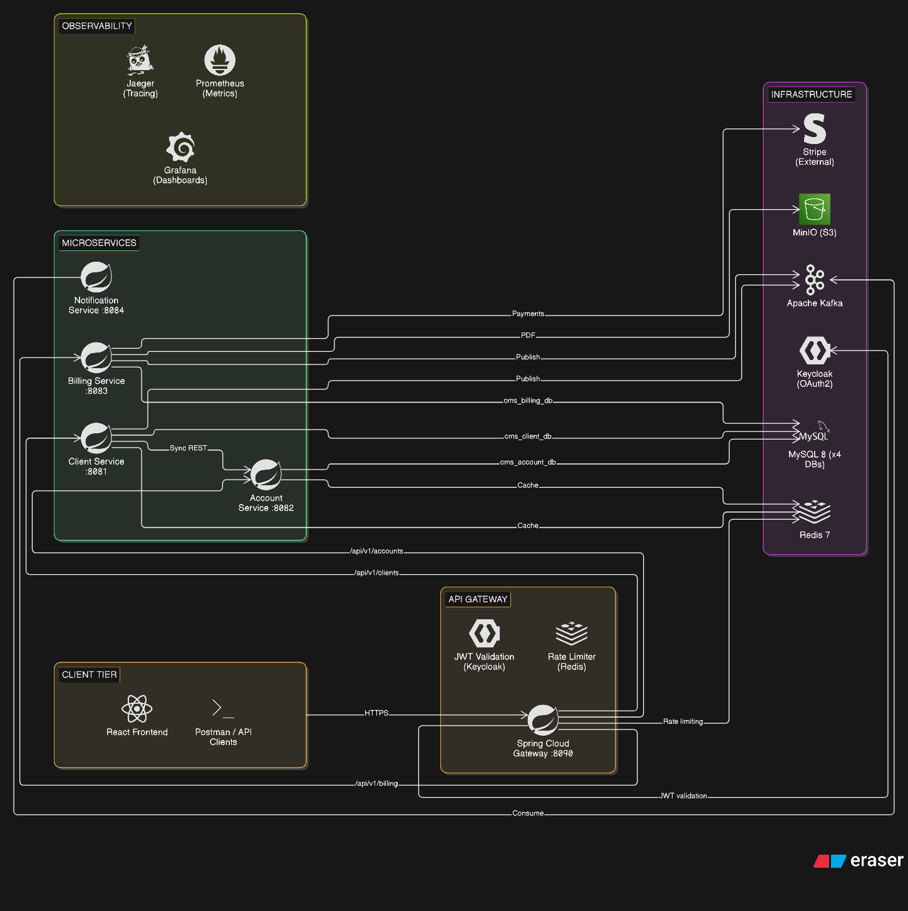

# CMS — Enterprise Client Management System

[](https://github.com/Srijan-Deb/Client-Management-System/actions/workflows/ci.yml)
[](https://github.com/Srijan-Deb/Client-Management-System/actions/workflows/codeql.yml)
[](LICENSE)
[](https://openjdk.org/projects/jdk/21/)
[](https://spring.io/projects/spring-boot)
[](https://react.dev/)
[](https://www.typescriptlang.org/)
[](https://kafka.apache.org/)
[](https://clickhouse.com/)

An enterprise-grade, distributed, event-driven B2B Client Management & Billing microservices platform built with **Java 21**, **Spring Boot 3.3**, **Apache Kafka**, **ClickHouse**, **MySQL 8**, **Redis**, **Keycloak 24**, and a modern **React 19 + TypeScript** administration web application.

---

## 🏛️ System Architecture



### High-Level Topology

```
+-----------------------------------------------------------------------------------+
|                                 CLIENT & WEB TIER                                 |
|          cms-admin (React 19 + Vite + TypeScript)  |  Postman API Clients         |
+-----------------------------------------------------------------------------------+
                                         │  HTTPS / REST
                                         ▼
+-----------------------------------------------------------------------------------+
|                                     EDGE TIER                                     |
|               API Gateway (Spring Cloud Gateway :8090, Reactive WebFlux)          |
|                   Keycloak 24 (OAuth2 / OIDC, RS256 JWT, RBAC)                    |
+-----------------------------------------------------------------------------------+
         │                        │                     │                    │
         ▼                        ▼                     ▼                    ▼
+-----------------+      +-----------------+   +-----------------+  +-----------------+
|  Client Service |      | Account Service |   | Billing Service |  |Analytics Service|
|      :8081      |      |      :8082      |   |      :8083      |  |      :8085      |
+-----------------+      +-----------------+   +-----------------+  +-----------------+
         │                        │                     │                    │
         └────────────────────────┼─────────────────────┴────────────────────┤
                                  │                                          │
                                  ▼                                          ▼
                      +───────────────────────+                  +───────────────────────+
                      |     Apache Kafka      |                  |  ClickHouse Columnar  |
                      |  (Event-Driven Bus)   |                  |    (OLAP Analytics)   |
                      +───────────────────────+                  +───────────────────────+
                                  │
                                  ▼
                      +───────────────────────+
                      |  Notification Service |
                      |         :8084         |
                      +───────────────────────+
                                  │
                                  ▼
                      [ Email / SMTP Dispatch ]
```

---

## 🚀 Microservices Overview

| Service | Port | Primary Responsibilities | Key Technologies |
|---|---|---|---|
| **`api-gateway`** | `8090` | Unified API entry point, JWT validation, Redis rate-limiting (20 req/s), dynamic route forwarding, CORS configuration | Spring Cloud Gateway, WebFlux, Redis |
| **`client-service`** | `8081` | Client onboarding, multi-address and multi-contact registry, support ticketing engine, internal client lookups | Spring Data JPA, MySQL, Kafka Producer, Resilience4j |
| **`account-service`** | `8082` | Multi-tenant account management, organization hierarchy, account-to-client linking | Spring Data JPA, MySQL, Redis Cache |
| **`billing-service`** | `8083` | Contracts, subscription lifecycle, automated invoice PDF generation, Stripe payment integration, MinIO document storage | Spring Data JPA, Stripe SDK, MinIO S3, iText PDF |
| **`notification-service`**| `8084` | Asynchronous Kafka event consumer, HTML templated emails (onboarding, invoice, payments, tickets), dead-letter topic (DLT) | Spring Kafka, Thymeleaf, JavaMailSender |
| **`analytics-service`** | `8085` | High-throughput Kafka stream consumer, ClickHouse event ingestion, real-time analytics aggregation | Spring Boot, ClickHouse JDBC, Kafka |
| **`cms-admin`** | `5173` | Responsive web portal for staff and clients, analytics dashboards, client management, invoice & payment management | React 19, TypeScript, Vite, Tailwind CSS, TanStack Query |

---

## 🛠️ Technology Stack

- **Core Backend:** Java 21 (Virtual Threads enabled), Spring Boot 3.3.2, Spring Cloud 2023.0.3
- **Security & IAM:** Keycloak 24.0.5 (OpenID Connect, OAuth2, RS256 JWT, Role-Based Access Control)
- **Frontend App:** React 19, TypeScript, Vite, Tailwind CSS, TanStack Query, Lucide Icons, Keycloak-JS
- **Event Streaming:** Apache Kafka 3.7 (trace propagation with W3C baggage)
- **Databases & Storage:**
  - **MySQL 8.0**: Dedicated schema per microservice with Flyway database migrations
  - **ClickHouse**: Fast columnar analytical database for event aggregation and metrics
  - **Redis 7.0**: Distributed cache and API Gateway sliding-window rate limiting
  - **MinIO**: S3-compatible object storage for contract and invoice PDF storage
- **Observability & Monitoring:**
  - OpenTelemetry + Micrometer distributed tracing -> **Jaeger** (`:16686`)
  - Prometheus metric collection (`:9090`) + **Grafana** dashboards (`:3000`)
  - **Alertmanager** (`:9093`) for alert dispatch
- **Containerization & Deployment:** Docker Compose, Docker Compose Cluster (HAProxy), Kubernetes (k3d), Helm Charts

---

## 🔐 Security & Role-Based Access Control (RBAC)

The system enforces end-to-end stateless security via Keycloak JWT tokens:

| Role | Permissions & Access Scope |
|---|---|
| **`ADMIN`** | Full access to all services, user administration, tenant configuration, and billing |
| **`ACCOUNT_MANAGER`** | Manage clients, accounts, contracts, subscriptions, and issue invoices |
| **`SUPPORT_AGENT`** | View client profiles, manage support tickets, update ticket statuses |
| **`BILLING`** | Manage invoices, process payment transactions, view billing analytics |
| **`CLIENT`** | Client self-service portal: view own company details and manage their own support tickets |

---

## ⚡ Quick Start Guide

### Prerequisites

- **Java 21 JDK**
- **Maven 3.9+**
- **Node.js 20+** and **npm**
- **Docker & Docker Compose** (minimum 8 GB RAM allocated)

---

### Step 1: Clone Repository & Setup Environment

```bash
git clone https://github.com/Srijan-Deb/Client-Management-System.git
cd "Client Management System"

# Copy environment variables template
cp .env.example .env
```

---

### Step 2: Start Infrastructure with Docker

Launch MySQL, Kafka, Redis, Keycloak, MinIO, ClickHouse, Prometheus, and Grafana:

```bash
docker compose up -d
```

Verify all containers are healthy:
```bash
docker compose ps
```

---

### Step 3: Build & Launch Microservices

#### Option A: One-Click Startup (PowerShell)
```powershell
# Automatically builds and starts all microservices in separate windows
.\start_all.ps1
```

To stop all services later:
```powershell
.\stop_all.ps1
```

#### Option B: Manual Startup (Terminal per service)
```bash
# Root build
mvn clean package -DskipTests

# Start each service
cd api-gateway && mvn spring-boot:run
cd client-service && mvn spring-boot:run
cd account-service && mvn spring-boot:run
cd billing-service && mvn spring-boot:run
cd notification-service && mvn spring-boot:run
cd analytics-service && mvn spring-boot:run
```

---

### Step 4: Launch Web Administration Frontend (`cms-admin`)

```bash
cd cms-admin
npm install
npm run dev
```

The admin web portal will be accessible at: **`http://localhost:5173`**

---

## 🌐 Default Service Endpoints & Credentials

| Service / Tool | URL | Default Credentials | Description |
|---|---|---|---|
| **Admin Web UI** | `http://localhost:5173` | Keycloak user login | Staff & Client Portal |
| **API Gateway** | `http://localhost:8090` | Bearer JWT Header | Core API Gateway |
| **Keycloak IAM** | `http://localhost:8080` | `admin` / `admin` | Identity & Access Management |
| **Grafana** | `http://localhost:3000` | `admin` / `admin` | Real-time Metrics & Dashboards |
| **Jaeger Tracing** | `http://localhost:16686` | *(No auth)* | Distributed Tracing UI |
| **Prometheus** | `http://localhost:9090` | *(No auth)* | Metrics Engine |
| **MinIO Console** | `http://localhost:9001` | `minioadmin` / `minioadmin` | Object Storage Console |
| **MailHog / Mailpit** | `http://localhost:8025` | *(No auth)* | Local SMTP Email Viewer |

---

## 🧪 Testing & Quality Assurance

```bash
# Execute unit and integration tests (uses Testcontainers for MySQL and Kafka)
mvn test

# Run tests with JaCoCo code coverage report
mvn verify -Pcoverage

# Run Frontend unit & component tests
cd cms-admin
npm run test

# Run Frontend Playwright end-to-end tests
npm run test:e2e
```

---

## 📦 High Availability & Kubernetes Deployment

- **Clustered Docker Compose:**
  ```bash
  docker compose -f docker-compose.cluster.yml up -d
  ```
- **Kubernetes Helm Chart:**
  ```bash
  helm install cms ./helm/cms --namespace cms --create-namespace
  ```
- **K3d Local Cluster Deployment:**
  ```powershell
  .\k3d-deploy.ps1
  ```

---

## 📖 Comprehensive Documentation

For complete, detailed instructions on API specifications, database schemas, message event schemas, and operational runbooks, refer to:
- [Complete Project Documentation Handbook](PROJECT_DOCUMENTATION.md)
- [Client Login Setup Guide](docs/CLIENT_LOGIN_SETUP_GUIDE.md)
- [Production Readiness Roadmap](docs/PRODUCTION_READINESS_ROADMAP.md)

---

## 📄 License

This project is licensed under the MIT License — see the [LICENSE](LICENSE) file for details.
