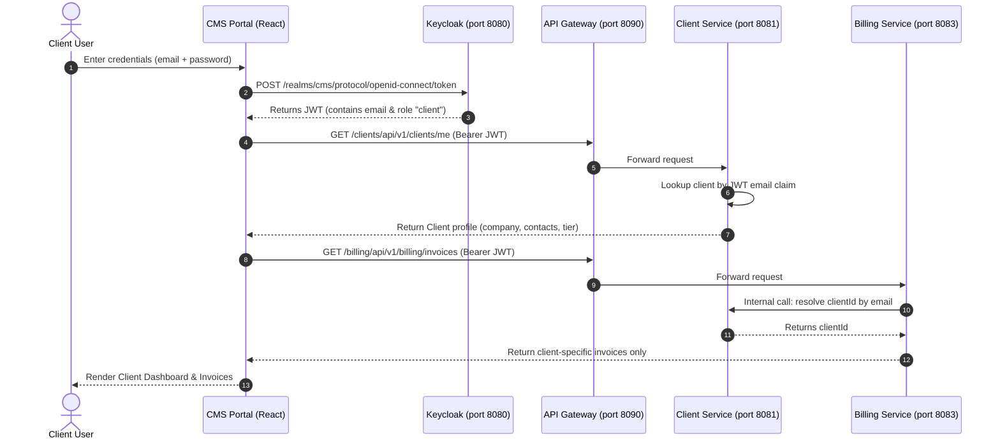

# Client Login Setup & Identity Provisioning Guide

This document provides complete instructions for provisioning and configuring new **Client User Accounts** in the Client Management System (CMS), enabling clients to securely access their personalized Client Portal.

---

## 1. System Architecture & Authentication Flow

The CMS platform enforces multi-tenant data isolation using OAuth2 / OpenID Connect tokens issued by Keycloak:



> [!IMPORTANT]
> **Email Identity Mapping Rule:**
> Keycloak user accounts and CMS database records are linked by **Email Address**.
> The `email` specified in the Keycloak user account **MUST EXACTLY MATCH** the `email` stored in the `cms_client.clients` database table.

---

## 2. Step-by-Step Manual Provisioning Workflow

Setting up a new client login consists of two phases:
- **Phase A**: Registering the Client in CMS (creates business profile and account).
- **Phase B**: Creating the Login Identity in Keycloak (creates authentication credentials and RBAC role).

---

### Phase A: Register the Client in CMS

If the client is already registered in the system (e.g. `srijan@cms.local`), proceed directly to **Phase B**. Otherwise:

1. Open the CMS Portal in your browser: [http://localhost:4200/login](http://localhost:4200/login)
2. Sign in as an administrator:
   - **Username / Email:** `admin`
   - **Password:** `Admin@1234`
3. From the left navigation menu, click **Clients**.
4. Click the **+ New Client** button in the upper-right corner.
5. Enter the company and contact information:
   - **Company Name:** e.g., `Ocean Water` or `Acme Corp`
   - **Contact Person:** e.g., `Srijan Deb`
   - **Email:** e.g., `srijan@cms.local` *(make note of this email)*
   - **Phone:** e.g., `+91 98765 43210`
   - **Tier:** `STANDARD`, `PREMIUM`, or `ENTERPRISE`
6. Click **Save** / **Create Client**.
   - This atomically creates the client in `client-service`, provisions the ledger account in `account-service`, and updates the cache.

---

### Phase B: Configure User Credentials in Keycloak

1. Open Keycloak Admin Console: [http://localhost:8080/admin/](http://localhost:8080/admin/)
2. Sign in with the Keycloak master administrator account:
   - **Username:** `admin`
   - **Password:** `admin123`
3. In the top-left dropdown (beneath the Keycloak logo), switch from `master` to the **`cms`** realm.

#### Step 1: Create the User
1. In the left navigation menu under **Manage**, click **Users**.
2. Click the **Add user** button.
3. Fill in the user details:
   - **Username:** e.g., `srijan@cms.local` (or a short handle like `srijan`)
   - **Email:** `srijan@cms.local` *(Must match the CMS Client email)*
   - **First name:** e.g., `Srijan`
   - **Last name:** e.g., `Deb`
   - **Email verified:** Toggle to **ON** (`true`)
   - **Enabled:** Toggle to **ON** (`true`)
4. Click **Create** (or **Save**).

#### Step 2: Set the Password
1. In the user detail screen, click the **Credentials** tab at the top.
2. Click **Set password**.
3. In the popup dialog:
   - **Password:** Enter a strong password, e.g., `Test@1234`
   - **Password confirmation:** Re-enter `Test@1234`
   - **Temporary:** Toggle to **OFF** (`false`)
4. Click **Save** ➔ confirm **Set password**.

> [!WARNING]
> Ensure **Temporary** is toggled **OFF**. If left ON, the system will prompt the user to change their password on first login via Keycloak's web form instead of allowing immediate portal access.

#### Step 3: Assign the Client Role
1. Click the **Role mapping** tab at the top.
2. Click **Assign role**.
3. Select **Filter by realm roles**.
4. Check the box next to **`client`**.
5. Click **Assign**.
6. Verify that `client` appears in the Assigned Roles table.

---

## 3. Signing In as the Client

1. Open an Incognito / Private window or log out of the current session at [http://localhost:4200/login](http://localhost:4200/login).
2. Enter the credentials:
   - **Username or Email:** `srijan@cms.local`
   - **Password:** `Test@1234`
3. Click **Sign In with Validated Credentials**.

### Password Policy Requirements
The CMS Portal login interface enforces an enterprise strong password policy:
- Minimum **8 characters**
- At least **1 uppercase letter** (`A-Z`)
- At least **1 lowercase letter** (`a-z`)
- At least **1 numerical digit** (`0-9`)
- At least **1 special character** (`@$!%*?&#^()_+-=`)

---

## 4. Automated 1-Click PowerShell Script

To avoid navigating the Keycloak Admin Console manually, use the helper script [create_client_user.ps1](file:///c:/Users/dell/Downloads/Client%20Management%20System/create_client_user.ps1) located in the project root:

```powershell
.\create_client_user.ps1 -Email "srijan@cms.local" -FirstName "Srijan" -LastName "Deb" -Password "Test@1234"
```

---

## 5. Troubleshooting & Common Issues

| Issue / Symptom | Root Cause | Resolution |
| :--- | :--- | :--- |
| **"Client not found for email"** (HTTP 404 / 500 on dashboard) | The email in Keycloak does not match any record in `cms_client.clients`. | Verify spelling in Keycloak Admin ➔ Users ➔ Email. Check database via: `SELECT * FROM cms_client.clients WHERE email = '<email>';`. |
| **"Account is not fully set up"** / Redirect loop | The password in Keycloak was marked as **Temporary**. | In Keycloak Admin ➔ Users ➔ Credentials, re-enter password and ensure **Temporary is OFF**. |
| **"Access Denied"** on Invoices / Billing | Missing the `client` role in Keycloak. | In Keycloak Admin ➔ Users ➔ Role mapping, ensure the role `client` is assigned. |
| **Login button disabled** in CMS Portal | Password does not satisfy strong password policy. | Ensure password has 8+ characters, uppercase, lowercase, numeric digit, and special character (e.g. `Test@1234`). |
| **"Invalid username or password"** | Wrong credentials or user account disabled in Keycloak. | Check Users ➔ Details ➔ Enabled is set to **ON**. Reset password via Credentials tab. |
